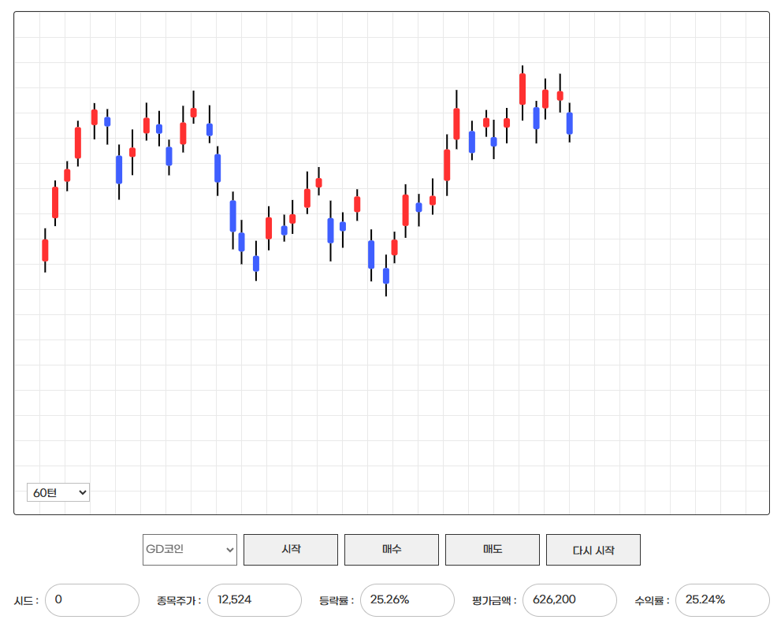
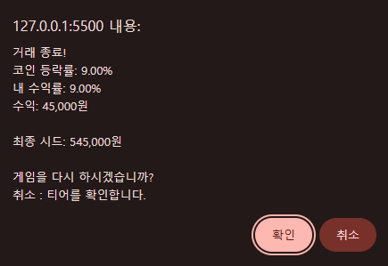
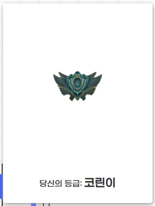
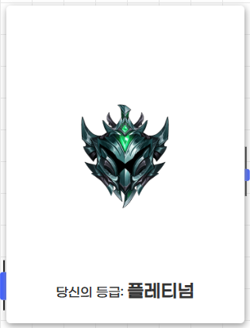
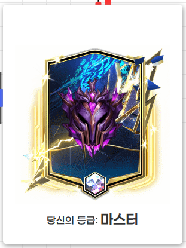

### ⭐ Coin Simulator (코인 시뮬레이터)

<br>

### 소개 (Overview)

> HTML/JS 기반으로 제작한 랜덤 차트 기반 코인 시뮬레이터입니다.
> 실제 코인 차트처럼 가격이 랜덤 등락하며, 매수·매도, 수익률 계산, 평가금액 표시 등을 직접 체험할 수 있습니다.
> 프론트엔드 중심 프로젝트지만, 추후 Spring Boot 백엔드 연동을 고려한 구조로 설계되었습니다.

<Br>

### ⚙️ 주요 기능 (Features)

- 랜덤 등락률 기반 실시간 캔들 차트 생성
- 시드(seed) 기반 포트폴리오 관리
- 매수/매도 기능
- 수익률·평가금액·평단 계산
- 게임 종료 후 티어(rank) 표시
- LocalStorage 기반 상태 유지
- 향후 백엔드 연동을 위한 API 구조 설계

<Br>

### ⚙️ 기술 스택 (Tech Stack)

| 구분           | 사용 기술                     |
| -------------- | ----------------------------- |
| Frontend       | HTML, CSS, Vanilla JavaScript |
| Backend (예정) | Spring Boot, Java 17          |
| Tools          | Git, GitHub                   |
| Docs           | Markdown, ERD, API Spec 작성  |

<Br>

### 📂 프로젝트 구조 (Project Structure)

```bash
/coin-simulator
 ├── client/                 # 프론트엔드
 │     ├── public/
 │     │     └── index.html
 │     ├── src/
 │     │     ├── css/style.css
 │     │     ├── js/
 │     │     │     ├── engine/            # Portfolio, StockEngine, GameEngine
 │     │     │     ├── ui/                # ChartRenderer 등 UI 관련
 │     │     │     └── app.js
 │     │     └── assets/
 │     └── README.md
 │
 ├── server/                 # 백엔드 확장 예정
 │     └── springboot/
 │            ├── build.gradle
 │            ├── src/main/java/com/wondongin/coinsimulator/controller/
 │            │     ├── ChartController.java
 │            │     ├── TradeController.java
 │            │     └── PortfolioController.java
 │            ├── api/
 │            │     ├── chart.http
 │            │     ├── trade.http
 │            │     └── portfolio.http
 │            └── application.yml
 │
 ├── docs/
 │     ├── screenshots/
 │     ├── erd.md
 │     ├── api-spec.md
 │     └── architecture.md
 │
 ├── .gitignore
 └── README.md
```

<br>

### 🗄 핵심 로직 (Core Logic)

1. 도메인 모델 (Portfolio) : 시드/수량/평단 관리 도메인 모델
2. 비즈니스 엔진 (StockEngine) : 가격 랜덤 변동 엔진
3. 게임 컨트롤러 (GameEngine) : 턴 기반 전체 게임 흐름 관리
4. UI 렌더러 (ChartRenderer) : 차트 UI 렌더링

<br>

### 1. Portfolio (포트폴리오 관리)

- 보유 수량, 평단, 시드를 관리하는 핵심 도메인 로직

```javascript
buy(price) {
  const quantity = Math.floor(this.seed / price);
  if (quantity <= 0) return 0;

  const cost = quantity * price;

  if (this.shares === 0) {
    this.averagePrice = price;
  } else {
    this.averagePrice =
      (this.shares * this.averagePrice + quantity * price) /
      (this.shares + quantity);
  }

  this.shares += quantity;
  this.seed -= cost;
  return quantity;
}

```

### 2. ChartRenderer (차트 렌더링)

- 랜덤 등락률 기반으로 캔들을 생성하고 차트에 배치

```javascript
addCandle(isUp, ratePercent, prevY) {
  const change = ratePercent * 3;
  const noise = (Math.random() - 0.5) * 8;
  let newY = (isUp ? prevY - change : prevY + change) + noise;

  const candle = document.createElement("div");
  candle.classList.add("candle");

  // 고가/저가 꼬리(wick), 바디(body)
  const wickHigh = document.createElement("div");
  const wickLow = document.createElement("div");
  const body = document.createElement("div");

  this.container.appendChild(candle);
  this.chartsY.push(newY);

  return newY;
}

```

### 3. StockEngine (가격 변동 로직)

- 코인의 가격이 랜덤 등락률로 변하는 핵심 엔진
- 등락률 / 누적 등락 factor / 반올림 / 절대값 처리

```javascript
updatePrice() {
  const isUp = Math.random() < 0.5;
  const ratePercent = Math.floor(Math.random() * 10) + 1;
  const rate = ratePercent / 100;

  if (isUp) {
    this.price *= 1 + rate;
    this.udFactor *= 1 + rate;
  } else {
    this.price *= 1 - rate;
    this.udFactor *= 1 - rate;
  }

  this.price = Math.round(this.price);

  return {
    price: this.price,
    isUp,
    ratePercent,
    udRatePercent: this.getUdRatePercent(),
  };
}

```

### 4. GameEngine (턴 기반 게임 흐름 제어)

- 게임을 턴(turn) 단위로 진행시키는 핵심 컨트롤러
- 컨트롤러 → 서비스 → 도메인 구조 (Chart + Portfolio + StockEngine)

```javascript
step() {
  if (this.over) return null;

  const tick = this.stockEngine.updatePrice();
  this.turn++;

  const evaluation = this.portfolio.getEvaluation(this.stockEngine.price);
  const profitRate = this.portfolio.getProfitRate(this.stockEngine.price);

  if (this.turn >= this.maxTurns) {
    this.portfolio.sell(this.stockEngine.price);
    this.over = true;
    return { tick, autoEvent: "auto-sell" };
  }

  return { tick, evaluation, profitRate };
}
```

<Br>

### 🗄 DB 구조 (Optional)

> 현재는 DB를 사용하지 않지만,
> 향후 백엔드 확장을 염두한 ERD 구조를 설계

```nginx
Portfolio (포트폴리오)
- id (PK)
- seed
- shares
- average_price

TradeHistory (거래 내역)
- id (PK)
- portfolio_id (FK)
- type (BUY / SELL)
- price
- quantity
- created_at

ChartTick (가격 로그) — optional
- id (PK)
- price
- rate
- created_at
```

ERD 파일: `/docs/erd.md`

<br>

### 🔍 API 명세 (Backend)

> 코인 가격 조회, 가격 변동(틱), 매수·매도, 포트폴리오 조회 기능 중심의 간단한 API 명세

> 자세한 내용 → `/docs/api-spec.md`

| Method | Endpoint         | Description         |
| ------ | ---------------- | ------------------- |
| GET    | /chart/price     | 현재 코인 가격 조회 |
| GET    | /chart/tick      | 가격 변동(틱) 생성  |
| POST   | /trade/buy       | 코인 매수           |
| POST   | /trade/sell      | 코인 매도           |
| GET    | /portfolio       | 내 포트폴리오 조회  |
| POST   | /portfolio/reset | 포트폴리오 초기화   |

### 1. GET /chart/price (현재 코인 가격 조회)

Response

```json
{
  "price": 10000
}
```

### 2. GET /chart/tick (가격 변동(1틱 생성))

Response

```json
{
  "message": "Tick updated",
  "price": 10230,
  "changeRate": 2.3
}
```

### 3. POST /trade/buy (코인 매수 API)

Request

```json
{
  "symbol": "GD",
  "price": 10000,
  "quantity": 3
}
```

Response

```json
{
  "status": "success",
  "message": "매수 완료",
  "buyPrice": 10000,
  "quantity": 3
}
```

### 4. POST /trade/sell (코인 매도 API)

Request

```json
{
  "symbol": "GD",
  "price": 11000,
  "quantity": 3
}
```

Response

```json
{
  "status": "success",
  "message": "매도 완료",
  "sellPrice": 11000,
  "quantity": 3
}
```

### 5. GET /portfolio (현재 포트폴리오 상태 조회)

Response

```json
{
  "seed": 500000,
  "shares": 3,
  "averagePrice": 9500,
  "evaluation": 33000,
  "profitRate": 10.52
}
```

<Br>

### 🔍 화면 예시 (Screenshots)

#### 캔들 차트 화면



#### 수익률/평가금액 UI



#### 티어(rank) 팝업





<Br>

### 📄 배운 점 (What I Learned)

- Vanilla JS로 상태 관리 + 도메인 로직 분리하는 경험
- 차트 렌더링(캔들 차트) 기반 UI 동작 흐름 이해
- 백엔드를 고려한 프로젝트 디렉토리 구조 설계
- API 명세서, ERD, 아키텍처 문서를 직접 작성해보며 문서화 역량 강화

  - 리팩토링이 얼마나 중요한지 체감(초기 spaghetti → 구조화된 JS)

  <Br>

### 📄 추후 개선 계획 (Improvements)

- Spring Boot 기반 백엔드 구현 (REST API → 실제 연동)
- ChartTick DB 저장 및 차트 재생 기능 추가
- WebSocket 기반 실시간 차트 구현
- 사용자 로그인 추가 → 개인 포트폴리오 저장
- 반응형 UI 개선
